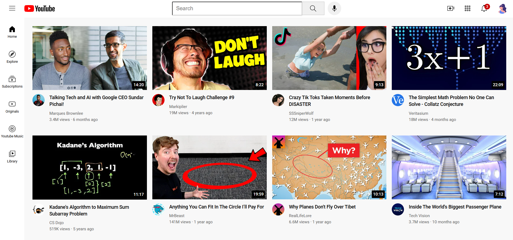

# YouTube Clone – HTML & CSS

A responsive YouTube homepage clone built using HTML and CSS as part of my frontend development learning journey.

## About the Project

I built this project by following the **HTML & CSS Full Course** by **SuperSimpleDev**. The project helped me practice and understand how real-world web page layouts are created using HTML and CSS.

While following the tutorial, I implemented the project myself and practiced the concepts covered in the course.

## Features

* Responsive YouTube-style homepage
* Header with search bar and navigation icons
* Sidebar navigation
* Responsive video grid
* Video thumbnails and channel pictures
* Video titles, authors, views, and upload information
* CSS Grid and Flexbox
* Responsive design using CSS Media Queries
* Google Fonts integration
* Hover effects and tooltips

## Technologies Used

* HTML5
* CSS3
* CSS Grid
* Flexbox
* Media Queries
* Google Fonts

## What I Learned

Through this project, I practiced:

* Structuring webpages using HTML
* Working with `div`, semantic elements, and other HTML elements
* CSS Grid and responsive layouts
* Flexbox
* Positioning elements using CSS
* Creating responsive designs with media queries
* Using external fonts with Google Fonts
* Organizing HTML, CSS, images, and assets in a project

## Screenshot
